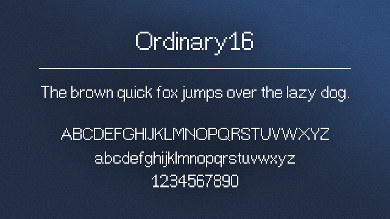
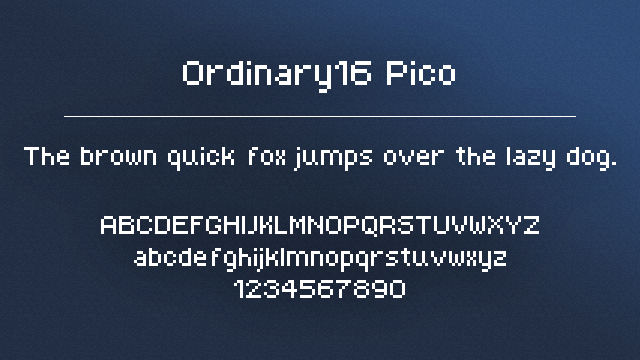

# **Ordinary16** - A free CC0 pixel art typeface

Ordinary16 is a sans-serif pixel-perfect font that's simple and legible. Designed for a base size of 16 as the name implies. It also comes with a smaller variant: Ordinary16 Pico.

  

  

## License

This font is released under the [CC0 license](https://creativecommons.org/publicdomain/zero/1.0/). You can copy, modify, distribute and perform the work, even for commercial purposes, all without asking permission.